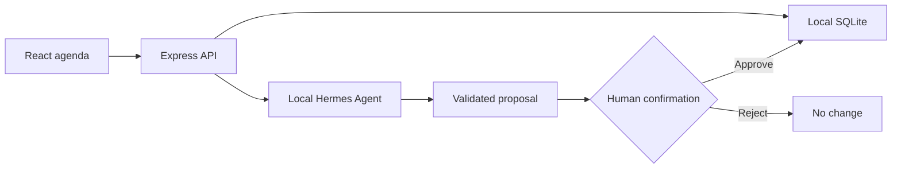

<div align="center">
  
  <h1>🦇 Personal Agenda</h1>
  <p><strong>A private command center for appointments, collections, and daily planning.</strong></p>
  <p>Batman-inspired, accessible, self-hosted, and enhanced by a human-approved local AI assistant.</p>
  <p>
    
    
    
    
  </p>
</div>

> [!IMPORTANT]
> This project was built with substantial AI assistance. Gustavo Martins owns
> the idea, product direction, final decisions, and validation.

## 🌃 What it does

Personal Agenda combines a responsive monthly calendar, appointment management,
personal collections, and optional Hermes assistance in one private web app.
The interface is currently in Brazilian Portuguese and works on desktop and
mobile.

| Calendar | Appointments | Collections | Private access |
| --- | --- | --- | --- |
| Full month grid | Create, edit, complete, delete | Topic-based personal lists | Tailscale Serve over HTTPS |
| Keyboard navigation | Categories, notes, duration | Search and duplicate protection | SQLite remains on your computer |
| Cross-month search | Strict date/time validation | Local persistence | No router port exposure |

## ✨ Current experience

- responsive Batman-inspired light and dark interface;
- today and selected-day states, category markers, and month navigation;
- text search tolerant of accents and capitalization;
- multi-category filters and cross-month grouped results;
- completion state preserved when an appointment is edited;
- sample data only on first use, with explicit reset and reload actions;
- modal focus trapping, screen-reader announcements, skip link, and reduced motion;
- automatic dated SQLite backups before private remote startup.

## 🤖 Hermes assistant

The **Assistant** panel talks to a local Hermes Agent through Express. The
browser never receives the private API key, and Hermes port `8642` is not
published through Tailscale.



Each conversation creates only a temporary proposal. Creating, editing, or
deleting an appointment requires **Confirm action** in the UI. The agenda keeps
working normally when Hermes is offline.

Before enabling the integration, isolate the Hermes API toolset:

```bash
hermes config set platform_toolsets.api_server '["no_mcp"]'
hermes config get platform_toolsets.api_server --json
```

The server reads `HERMES_API_BASE_URL`, `HERMES_API_SERVER_KEY`,
`HERMES_NO_MCP_CONFIRMED`, `HERMES_SESSION_ID`, and `HERMES_TIMEOUT_MS` from the
private environment file. Never expose these values to the browser.

## 🚀 Run locally

Requirements: Node.js 20.19+ or 22.12+, and npm.

```bash
npm install
npm run dev
```

The React app opens at `http://localhost:5173`. For the production package:

```bash
npm run build
npm start
```

Express serves the built interface, local API, and SQLite database on port
`3001`.

## 🔐 Private remote access

The recommended remote setup uses
[Tailscale Serve](https://tailscale.com/docs/features/tailscale-serve). Authorized
devices receive HTTPS access through the same tailnet while Express remains
bound to `127.0.0.1`.

```bash
npm run remote:start
```

This command builds the app, creates a dated SQLite backup, configures the
private HTTPS proxy, and prints the tailnet URL. Remove the published route with:

```bash
npm run remote:stop
```

> [!WARNING]
> Do not use `tailscale funnel`. Funnel would publish an app with no built-in
> login to the public internet. Use Tailscale Serve only.

After validating remote access, Linux users can install the user service:

```bash
npm run remote:install-service
systemctl --user status agenda-cavaleiro
```

## 🧱 Architecture

```text
src/                 React UI, calendar domain helpers, hooks, and API client
server/              Express endpoints, SQLite access, migrations, Hermes gateway
scripts/             backups, Tailscale startup, and systemd installation
data/agenda.sqlite   local source of truth (created at runtime)
backups/             dated local snapshots (ignored by Git)
```

The completion endpoint receives a desired state instead of toggling blindly,
making retries idempotent. Database migrations are additive so existing
appointments survive upgrades.

## 🧪 Quality

```bash
npm run typecheck
npm run lint
npm test
npm run build
```

Vitest and Testing Library cover calendar behavior, validation, API flows,
accessibility, persistence, and Hermes proposal safety.

## 🛡️ Privacy and boundaries

- all agenda data stays in local SQLite;
- no analytics, telemetry, or third-party database;
- remote access depends on the host computer and private Tailscale network;
- Hermes is optional and never mutates data without confirmation;
- this is a personal app, not a multi-user hosted service.

## 🤖 AI transparency

Implementation, testing, and documentation used substantial AI assistance
under human direction and review. Treat successful demos as evidence to verify,
not as a substitute for tests or security checks.

## 📄 License

Released under the [MIT License](LICENSE).
